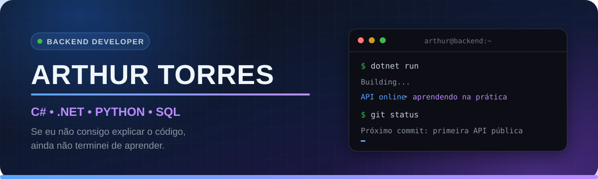

<div align="center">
  
</div>

<div align="center">

[](https://git.io/typing-svg)

</div>

## 👨‍💻 Sobre mim

```csharp
var arthur = new Developer
{
    Role = "Desenvolvedor Backend Jr.",
    Education = "Sistemas de Informação - UniFOA",
    Base = new[] { "Lógica", "POO", "SQL" },
    Stack = new[] { "C#", ".NET", "Python" },
    Studying = new[] { "ASP.NET Core", "Entity Framework", "APIs REST" },
    NextCommit = "Publicar minha primeira API com banco de dados"
};
```

- 🎓 Cursando **Sistemas de Informação na UniFOA** e **Programador Back-End no SENAI**
- 🧠 Estudando **POO, APIs REST, estruturas de dados, algoritmos e arquitetura em camadas**
- 🛠️ Desenvolvendo minha base com **C#, .NET, Python, MySQL e SQL Server**
- 🤝 Valorizo **comunicação, organização, aprendizado rápido e trabalho em equipe**
- 🎯 Em busca da minha **primeira oportunidade na área de tecnologia**

## 🧰 TECH STACK

<div align="center">
  <a href="https://skillicons.dev">
    
  </a>
</div>

<div align="center">


</div>

| Área | Tecnologias |
|:--|:--|
| **Linguagens** | C#, Python e SQL |
| **Backend** | .NET, ASP.NET Core, Entity Framework e APIs REST |
| **Banco de dados** | MySQL e SQL Server |
| **Ferramentas** | Git, GitHub, Visual Studio, VS Code e Postman |
| **Fundamentos** | Lógica, POO, estruturas de dados, algoritmos e arquitetura em camadas |

## 🧠 Além do código

Minha trajetória começou fora do desenvolvimento, mas trouxe habilidades que uso enquanto aprendo a programar:

| Experiência | O que levo para a tecnologia |
|:--|:--|
| **Eletricidade industrial** | Disciplina, segurança e atenção a processos técnicos |
| **Marketing** | Comunicação clara e visão de negócio |
| **Atendimento e vendas** | Escuta, organização e resolução de problemas |

## 🎯 Próximo checkpoint

```http
POST /portfolio/primeira-api

status: em planejamento
stack: C# + ASP.NET Core + Entity Framework + MySQL
entrega: CRUD + validações + documentação da API
```

## 🚀 Projetos em destaque

> 🧩 **Portfólio em construção:** meu primeiro projeto backend em C# e .NET será publicado aqui em breve, com documentação completa, API REST e banco de dados.

## 🤝 Vamos nos conectar

<div align="center">
  <a href="https://www.linkedin.com/in/arthur-torress/">
    
  </a>
</div>

---

<div align="center">
  <sub>📚 Hoje estudo o conceito; amanhã tento colocá-lo em uma API.</sub>
</div>
