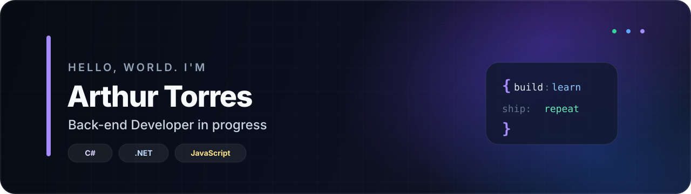

  

<h1 align="center">Olá, eu sou Arthur Torres 👋</h1>

  <strong>Back-end C#/.NET • APIs • Sistemas Web</strong>

  <samp>Código claro, projetos reais e evolução a cada commit.</samp>

  
  

---

## 👨‍💻 Sobre mim

Sou estudante de **Sistemas de Informação**, com foco em desenvolvimento **back-end C#/.NET**, construção de APIs e organização de regras de negócio.

Meu principal projeto é o **Gueto Barbearia**, um sistema de agendamento que reúne interface web e uma API em ASP.NET Core. O projeto transforma um fluxo real — escolher serviço, data e horário — em código, validações e endpoints.

Também trabalho com **Python**, **JavaScript**, **SQL** e **PostgreSQL**, conectando cada tecnologia a uma parte prática do desenvolvimento.

### ⚡ Em foco

- 🔨 **Projeto:** [Gueto Barbearia](https://github.com/Atorreszz/gueto-barbearia)
- ⚙️ **Back-end:** C#, ASP.NET Core Minimal APIs, Python, REST, HTTP e JSON
- 🗄️ **Dados:** SQL e PostgreSQL
- 🎯 **Objetivo:** primeira oportunidade em desenvolvimento de software/back-end

 

---

## 🧰 Tecnologias e ferramentas

### Back-end

  

C#, .NET 10, ASP.NET Core Minimal APIs, Python, REST, HTTP, JSON e Swagger/OpenAPI.

### Front-end

  

HTML, CSS e JavaScript com DOM, eventos, formulários e validações.

### Banco de dados

  

SQL e PostgreSQL para modelagem e persistência dos dados do Gueto Barbearia.

### Ferramentas

  

Git, GitHub, Linux, VS Code, Visual Studio, JetBrains Rider, WebStorm e testes de API com Swagger.

---

## 🛠️ Projeto em destaque

### [Gueto Barbearia](https://github.com/Atorreszz/gueto-barbearia)

Sistema de agendamento para barbearia com front-end interativo e API REST em ASP.NET Core.

- **Front-end:** catálogo com quatro serviços, manipulação do DOM, formulário, resumo do agendamento e validações de nome, WhatsApp, datas e horários.
- **API:** consulta de serviços e operações de criação, consulta, atualização e exclusão de agendamentos em memória, com validações e respostas HTTP.
- **Próximo passo:** persistência com SQL/PostgreSQL e integração do formulário com a API.

> O projeto está em desenvolvimento e ainda não utiliza banco de dados nem está publicado em produção.

[Ver código e acompanhar a evolução →](https://github.com/Atorreszz/gueto-barbearia)

---

## 📊 Atividade no GitHub

  
  

  

---

## 🤝 Vamos conversar?

  
  
  

  <samp>build • test • commit • repeat</samp>

